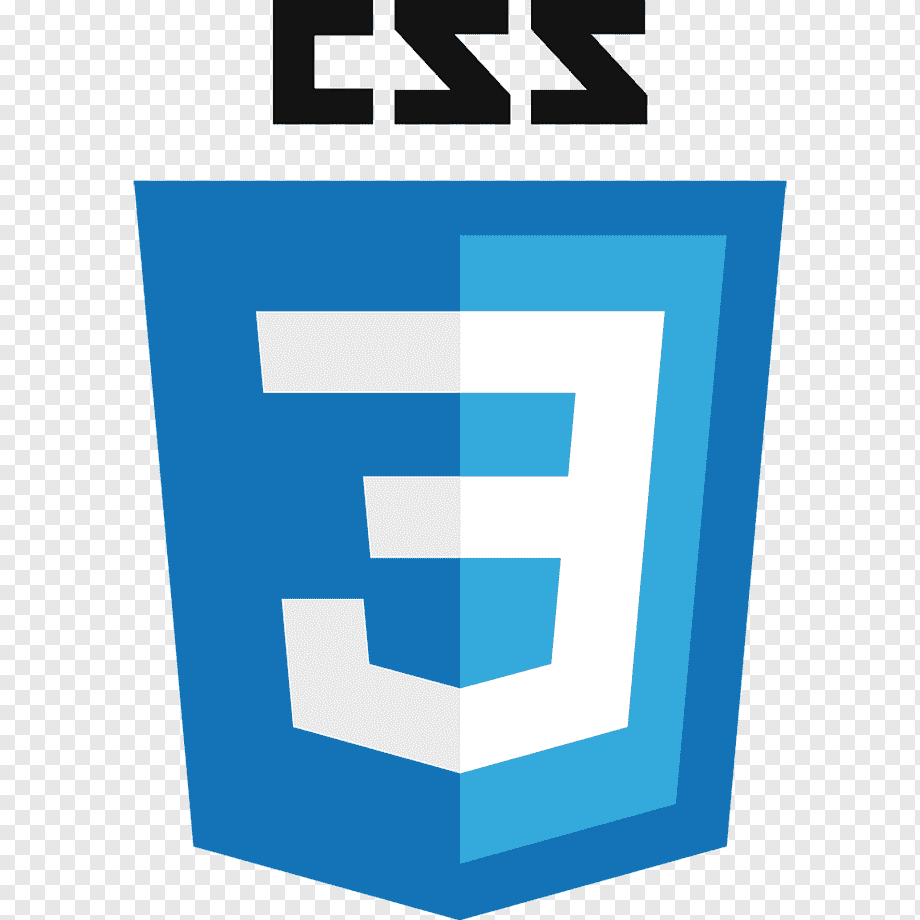

### Интерактивный веб-сервис на основе машинного обучения
---
 - Позволяет определить апостериорную вероятность ишемической болезни сердца
 - Алгоритм - логистическая регрессия
 - [Обучен на открытых данных WorldHealthOrganization](https://www.who.int/en/news-room/fact-sheets/detail/cardiovascular-diseases-(cvds))

### Языки и технологии:
---

